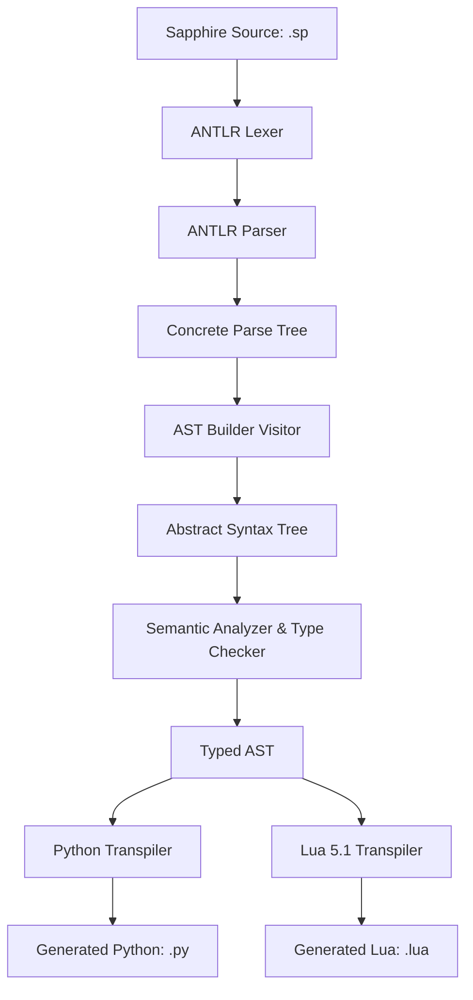

# Sapphire Compiler Pipeline Documentation

This document provides a comprehensive technical overview of the implementation of the **Sapphire Compiler**, transpiling Sapphire source code (`.sp`) to executable Python or Lua 5.1.

## Architecture Overview

The Sapphire compiler is structured as a classic multi-stage pipeline supporting multiple code generation targets:

## Stage 1: AST Design & Building

The Concrete Parse Tree generated by ANTLR contains parser-specific nodes (like parentheses, punctuation, and markers) that are redundant for compilation. Stage 1 designs a clean **Abstract Syntax Tree (AST)** and builds it using a visitor.

### 1. AST Node Design (`ast.py`)
All AST node classes inherit from a base `ASTNode` class defined in [ast.py](src/parser/ast.py):
- **Base Node**: Implements `to_dict()` for recursive JSON serialization, facilitating easy AST debugging and visualization.
- **Type Nodes**: Includes `BasicTypeNode`, `OptionalTypeNode`, and `FunctionTypeNode` to represent types in the AST.
- **Declarations**: Node classes represent top-level code structures: `ProgramNode`, `StructDeclNode`, `ImplBlockNode` (holding static/const/mutable methods), `FuncDeclNode`, and `TraitDeclNode`.
- **Statements**: Manage block execution and control flow: `VarDeclNode`, `AssignmentNode`, `IfNode` (supporting optional checks), `WhileNode`, `ForNode`, `ReturnNode`, and `ExprStmtNode`.
- **Expressions**: Handle operations: `LiteralNode`, `IdentifierNode`, `BinaryOpNode`, `UnaryOpNode`, `CallNode`, `MemberAccessNode` (supporting optional chaining `?.`), `CloneNode`, `LambdaNode`, `ArrayLiteralNode`, and `IndexExprNode`.

### 2. AST Building Visitor (`ast_builder.py`)
The `ASTBuilder` visitor class defined in [ast_builder.py](src/parser/ast_builder.py) inherits from ANTLR's generated `SapphireVisitor`:
- It overrides methods corresponding to parser grammar rules (like `visitProgram`, `visitVariableDeclarationStatement`, etc.).
- Converts rule context objects (`ctx`) into strongly-typed `ASTNode` objects.
- Correctly translates grammar alternatives (like `# AdditiveExpr`, `# CallExpr`) into their respective AST nodes.

## Stage 2: Semantic Analysis & Type Checking

Stage 2 enforces Sapphire's safety contracts, resolves lexical scopes, infers types, and validates compile-time constraints.

### 1. Scope & Symbol Management (`symbol_table.py`)
The Symbol Table defined in [symbol_table.py](src/semantics/symbol_table.py) manages symbols and types:
- **Lexical Scoping**: The `Scope` class maintains variable/type associations locally and points recursively to a parent scope. Entering a block enters a new nested scope; exiting pops it.
- **Shared Namespace**: Structs, functions, and variables all share the same namespace in each scope level, preventing name collisions.
- **Type System**: Standardizes compiler types: `PrimitiveType`, `OptionalType`, `FunctionType`, `StructType`, `TraitType`, and `ArrayType`.
- **Compatibility checking (`is_compatible`)**: Enforces assignability constraints (e.g. allowing assigning `int` to `float`, assigning `none` to an optional type `T?`, and assigning non-optional `T` to `T?` while rejecting reverse optional-to-non-optional casting).

### 2. Semantic Analysis Rules (`type_checker.py`)
The `TypeChecker` class in [type_checker.py](src/semantics/type_checker.py) traverses the AST and implements the following checks:
- **Global Pre-declarations**: Registers all structs, traits, and global functions first to support mutual recursion and forward-references.
- **Static Layout Copying**: Copies layout fields and methods from parent struct to child struct for static inheritance, and enforces that **no up-casting** is allowed (a child type cannot be assigned to a parent type).
- **Immutability Checking**: Enforces that constants declared with `let` cannot be reassigned.
- **Method & Constructor Safety**:
  - Verifies that methods called on constant objects are marked `const`.
  - Inside the constructor `__init__`, enforces that all non-optional struct fields are explicitly initialized.
  - Verifies that mutable reference (`var`) parameters are only passed mutable lvalues.
- **Conditional Bindings & Optional Safety**: Validates unwrapping (`let x ?= optional`) and init statements where variables are registered inside the nested control-flow scope.
- **Bidirectional Lambda Inference**: Resolves types of lambda parameters without annotations (e.g. `x -> x * 2`) by matching them against expected function types (like `(int) -> int`) in assignments or call sites.

## Stage 3: Code Generation (Transpilation)

Stage 3 compiles the typed AST into target language code (Python or Lua 5.1), mapping Sapphire semantics to the target runtime environment.

### 1. Python Target (`python_transpiler.py`)
- **Runtime Preamble**: Outputs `SapphireObject` and `Arena` classes. `SapphireObject` keeps a reference to `__proto__` and `__shadow__` for prototypal property delegation and CoW.
- **AST Mapping**: Compiles structs to Python classes, methods to instance/static methods, conditional bindings to `None` checks, and `??` to inline lambdas.
- **Annotation Erasure**: Erases `@extern var` declarations and cleanly strips `@export` target strings so cross-backend compilation remains functional.

### 2. Lua 5.1 Target (`lua_transpiler.py`)
- **Runtime Preamble**: Emits `Arena`, `_create_proto_object`, and `_clone_helper` using Lua's native `setmetatable` mechanism (`__index` fallback, `__proto`, `__shadow`).
- **Array Indexing**: Maps Sapphire 0-based array indexing (`arr[i]`) to 1-based Lua table indexing (`arr[i + 1]`).
- **Compound Assignment Expansion**: Expands compound assignment statements (`+=`, `-=`, `*=`, `/=`) into simple binary operation assignments (`x = x + y`).
- **Optionals & Lambdas**: Translates optional unwrapping bindings to safe Lua `nil` checks, `??` to anonymous-function coalescing, and Sapphire lambdas to Lua anonymous functions.
- **Host Engine Interop (`@extern` & `@export`)**:
  - `@extern var` declarations omit `local` initializations, leaving variable names bound to host global scope (e.g. `love`).
  - `@export("path")` functions generate global Lua function definitions (e.g., `function love.update(dt) ... end`).
  - Calls on host trait fields (e.g. `love.graphics.rectangle(...)`) transpile using dot notation (`.`) rather than colon (`:`) syntax.

### 3. High-Level Compiler Driver API (`transpile_file`)
The high-level compilation driver function `transpile_file(input_file, output_file, target="python", sourcemap=True)` in [transpiler.py](src/code_gen/transpiler.py) orchestrates the full compilation pipeline and dispatches AST code generation to either Python or Lua 5.1 depending on `target`. Both the `sapphire` CLI (`src/cli/sapphire.py`) and script runner (`src/run_transpiler.py`) invoke `transpile_file` directly.

## Stage 4: Source Map Generation & Love2D Debugging

When targeting Lua/Love2D, Sapphire generates v3 source maps (`.lua.map`) and embeds runtime stack-trace demanglers.

### 1. Source Map Builder (`source_map.py`)
- **V3 JSON Specification**: Implements Base64 VLQ (Variable-Length Quantity) encoding to format standard Source Map V3 JSON files containing `version`, `sources`, `sourcesContent`, and `mappings`.
- **Offline & IDE Debugging**: `.lua.map` sidecar files allow IDEs (such as VS Code) to set breakpoints and map runtime Lua execution back to Sapphire `.sp` source files without affecting game load times or RAM.

### 2. Runtime Stack-Trace Demangler & Love2D Error Screen
- **Inline Line Mapping Table**: Transpiled Lua code includes a compact `_SP_LINE_MAP` lookup table mapping generated Lua line numbers to original `.sp` files, line numbers, and source line snippets.
- **Love2D Crash Overlay Hook**: Overrides `love.errorhandler` and intercepts stack trace strings. When a runtime crash occurs in Love2D (e.g. missing asset, out-of-bounds index, or failed unwrap), both the terminal logs and Love2D's graphical error screen display demangled Sapphire `.sp` filenames, line numbers, and source code line snippets.
- **CLI Options**: Enabled by default for Lua transpilation. Can be disabled for production release builds using the `--no_sourcemap` CLI flag.
